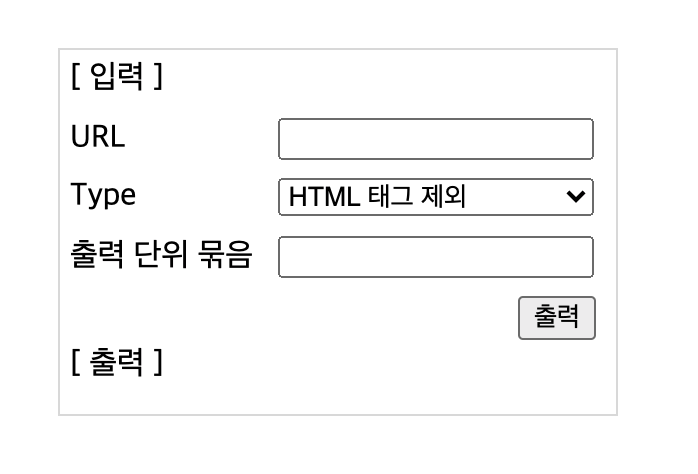
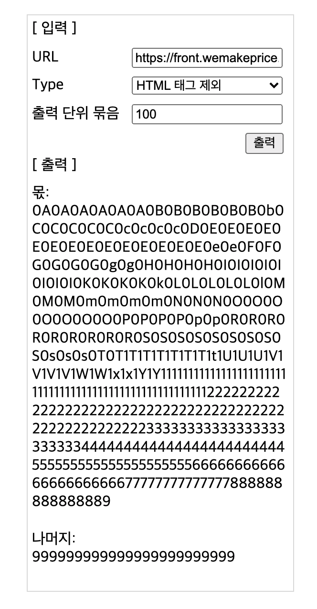

# 코딩 과제

## 요구 사항
> URL을 입력하여 전달 받은 HTML 문자열을 몫과 나머지로 출력

## 사용 방법
- 스프링 어플리케이션 실행
- 인덱스 페이지 이동
  - 로컬 환경: http://localhost:8080/
 
- URL 입력
- Type 선택
- 출력 단위 묶음 입력 (2,147,483,647 이하의 자연수)
- 출력 버튼 클릭
 